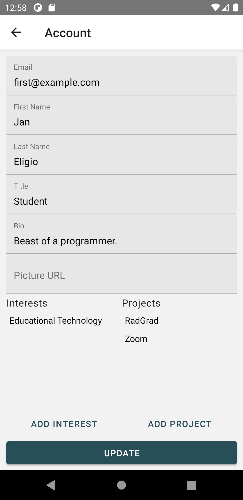

## Table of contents

* [Overview](#overview)
* [Functionality](#functionality)
* [Screens](#screens)
* [How to Run](#how-to-run)


## Overview

Blue Leopards is a reimplementation of the functionality of [Bowfolios](https://bowfolios.github.io) for mobile devices. Work has currently been done on the frontend using [React Native](https://reactnative.dev) for component-based UI design and [React Native Paper](https://callstack.github.io/react-native-paper/) for production-ready components. React Native is a cross-platform UI framework for iOS and Android devices. However, this project is designed with mostly Android devices in mind.

## Functionality

| Action | Description |
| --- | --- |
| Log In | Users log in by entering an email and password. |
| Sign Up | After users enter an email and password, they are automatically logged in and navigate to the projects page. |
| View Profiles | Scroll through all profiles, their interests, and projects they have contributed to. |
| View Projects | Scroll through all projects, their tagged interests, and contributors. |
| View Interests | Scroll through all interests and profiles and projects associated with them. |
| Manage Account | A user can update their personal account information as well as their interests and projects they have contributed to. |
| Filter Profiles | User can filter through profiles by a certain interest |
| Create Project | Create a new project and add its tags (interests) and contributors. |
| Log Out | User is logged out and navigates back to log in screen. |

## Screens

### Log In Page


### Sign Up Page


### Profiles Page


### Projects Page


### Interests Page


### Settings Page


### Account Settings Page



### Filter Page


### Create Project Page


## Functionality

## How To Run

Details on how to run this application on *Windows for Android* will be given. For more information on how to set up the development environment for macOS and Linux, refer to the [react native documentation](https://reactnative.dev/docs/environment-setup).

In order to run this application on your machine, you will need Node, the React Native CLI, Python 2, a JDK, and Android Studio. Although you may use any editor, Android Studio will be used as an emulator in order to run the application. 

You will then need the code which can be cloned or downloaded from the [repository](https://github.com/Blue-Leopards/BlueLeopards):
```
git clone https://github.com/Blue-Leopards/BlueLeopards.git
```
Make your way into the project directory:
The current frontend will be in the `client` directory. So, in the BlueLeopards directory, run:

```
cd blueleopards
```

You will then need to install the dependencies:

```
npm i
```

To run the application, you will need to start Metro, the JavaScript bundler that ships with React Native:

```
npx react-native start
```

Finally, start the application by opening another terminal and typing:

```
npx react-native run-android
```

If everything went well, you will see the app running in the Android emulator.